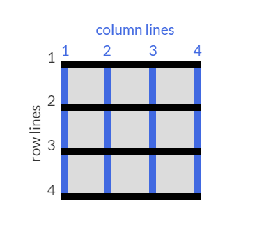

## CSS 网格布局

> `display: grid;`

亦分容器（Container）和子项（Items）两类属性。

`grid-template-columns`指定子项的列数及每项的大小；`grid-template-rows`指定和行数及每项的大小。单位中，`fr`表示可用空间的占比。

`grid-column-gap`指定列间距；`grid-row-gap`指定行间距。`grid-gap`为两者的速记形式。

一个网格模型中，由若干列线（Colmun Lines）和行线（Row Lines）分割而成。起始点从容器的左上角，用`1`表示，而后递增计数。

`grid-column`是子项属性，指定该项的水平跨度；`grid-row`则指定项的垂直跨度。值以`number1 / number2`的形式表示。`number1`表示起始线，`number2`表示终止线。

`justify-self`是子项属性，指定该项内容的水平对齐方式，类似 Flex Box 中的`justify-content`；`align-self`则指定项的垂直对齐方式，类型 Flex Box 中的`align-self`。